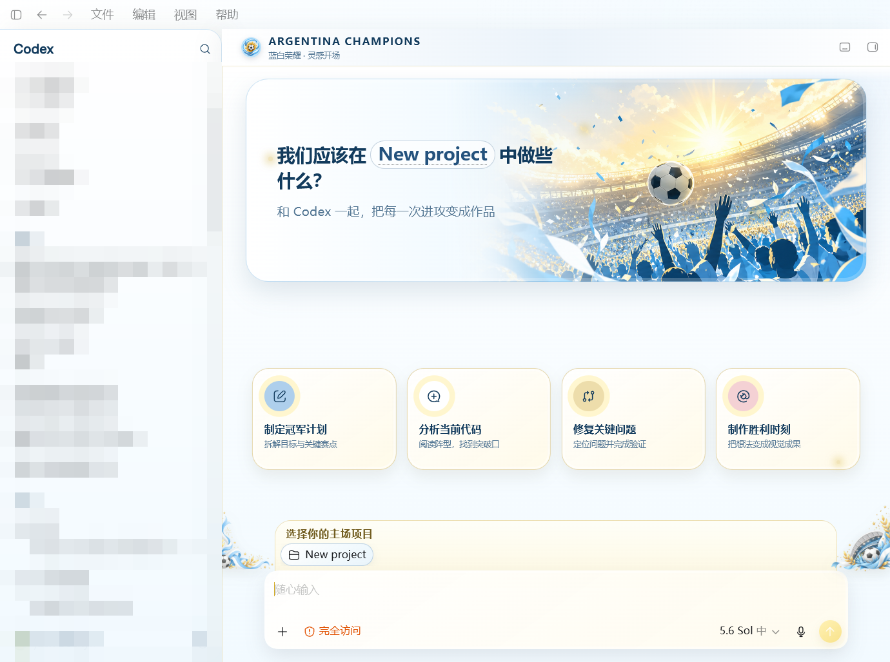
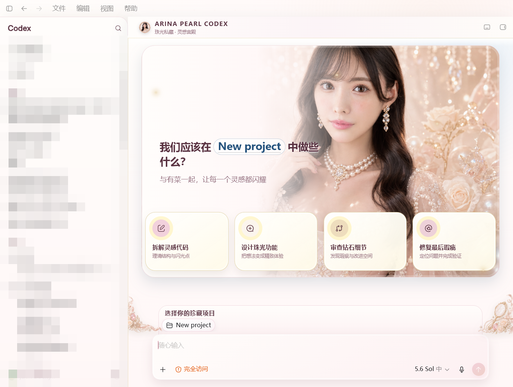
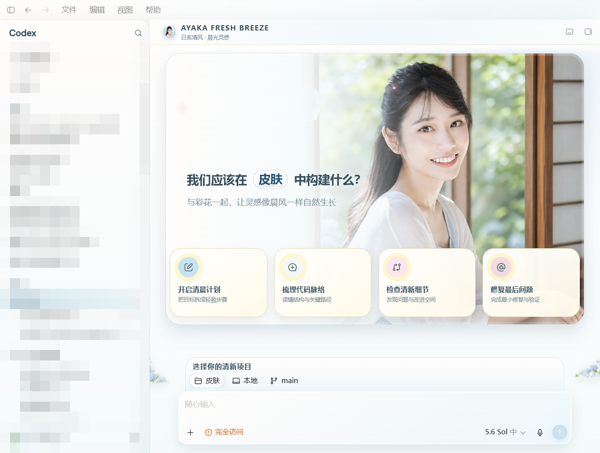
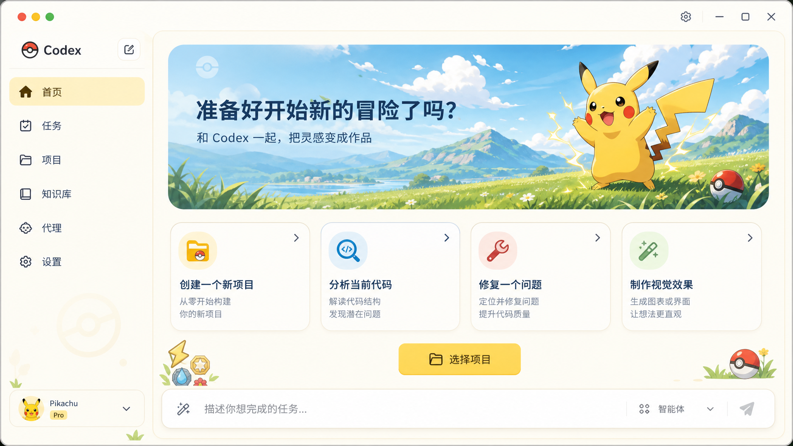

# Codex Theme Studio

A reusable Windows workflow for turning a visual direction into a packaged Codex desktop theme: manifest, GPT Image assets, live CDP injection, theme-specific shortcut icon, verification, and recovery.

## Theme showcase

<table>
  <tr>
    <td width="50%" align="center">
      <strong>Argentina Champions</strong><br><br>
      
    </td>
    <td width="50%" align="center">
      <strong>Arina Pearl Luxury</strong><br><br>
      
    </td>
  </tr>
  <tr>
    <td width="50%" align="center">
      <strong>Ayaka Fresh Breeze</strong><br><br>
      
    </td>
    <td width="50%" align="center">
      <strong>Pokémon Adventure</strong><br><br>
      
    </td>
  </tr>
</table>

These screenshots show themes created with Theme Studio. The public repository currently includes the original `Argentina Champions` package; the other themes are visual showcases only.

> This project modifies the local presentation of the Windows Codex desktop app at runtime. Codex updates can change internal DOM selectors; always keep the restore shortcut available.

## What is included

- One installable Codex Skill: `skills/codex-theme-studio`
- A manifest-driven theme engine; no theme-specific JavaScript is required
- Safe Store-app activation with a remote debugging port
- Multi-size Windows `.ico` generation from each theme's square PNG
- Install, start/switch, verify/screenshot, restore, and shortcut scripts
- An original `Argentina Champions` example without official tournament marks

## Install the Skill

Copy `skills/codex-theme-studio` into:

```text
%USERPROFILE%\.codex\skills\codex-theme-studio
```

Restart Codex so the Skill catalog refreshes.

## Use the example

```powershell
$skill = "$env:USERPROFILE\.codex\skills\codex-theme-studio"
$theme = "C:\path\to\codex-theme-studio\examples\argentina-champions"

node "$skill\scripts\validate-theme.mjs" --theme $theme
powershell -ExecutionPolicy Bypass -File "$skill\scripts\install-theme.ps1" -ThemePath $theme
powershell -ExecutionPolicy Bypass -File "$skill\scripts\start-theme.ps1" -ThemePath $theme
```

The installer creates `Codex - Argentina Champions` on the desktop and Start menu. The shortcut uses the theme's generated icon rather than the PowerShell icon.

## Verify and restore

```powershell
powershell -ExecutionPolicy Bypass -File "$skill\scripts\verify-theme.ps1" -ThemePath $theme -Screenshot "$PWD\qa.png"
powershell -ExecutionPolicy Bypass -File "$skill\scripts\restore-theme.ps1"
```

Use `-RestoreBaseTheme` only when you also want to restore the pre-install Codex color configuration. Theme Studio keeps that backup in `%LOCALAPPDATA%\CodexThemeStudio`.

## Create a theme

Read the Skill's `references/theme-package.md`, create a self-contained theme folder, generate the four image assets, validate it, then install it. Keep third-party licensing evidence outside public repositories.

## Requirements

- Windows 10 or 11
- Microsoft Store build of Codex
- PowerShell 5.1+
- Node.js 22+ (for built-in WebSocket support)

## License

MIT. Theme artwork can have separate rights; document them in each `theme.json`.
